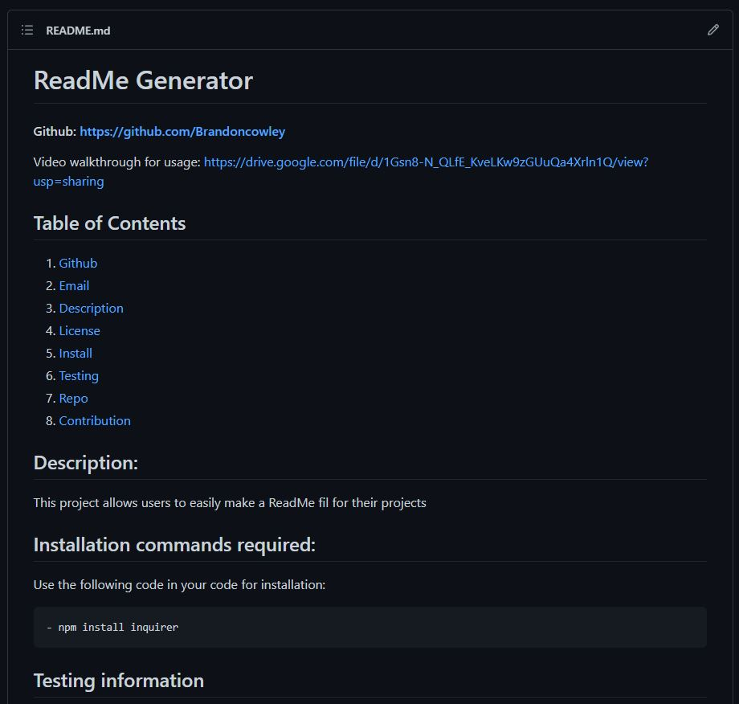

# ReadMe Generator
#### Github: https://github.com/Brandoncowley
Video walkthrough for usage: https://drive.google.com/file/d/1Gsn8-N_QLfE_KveLKw9zGUuQa4Xrln1Q/view?usp=sharing

### Screenshot of end product:

## Table of Contents
1. [Github](#github)
2. [Email](#email)
3. [Description](#description)
4. [License](#license)
5. [Install](#install)
6. [Testing](#test)
7. [Repo](#repo)
8. [Contribution](#contribution)
   
## Description: 
This template allows users to answer a series of prompts through the command line in their terminal to rapidly create a ReadMe file
        
## Installation commands required:
Use the following code in your code for installation:
```    
- npm install inquirer
```

## Testing information
npm test
## Repo
It is a wonderful place to me, obviously

##### Licensed with:
[](https://opensource.org/licenses/MIT)
## Contributor:
Brandon Cowley
## Email
You can contact the creator with questions regarding the generator at brandon.cowley@gmail.com
